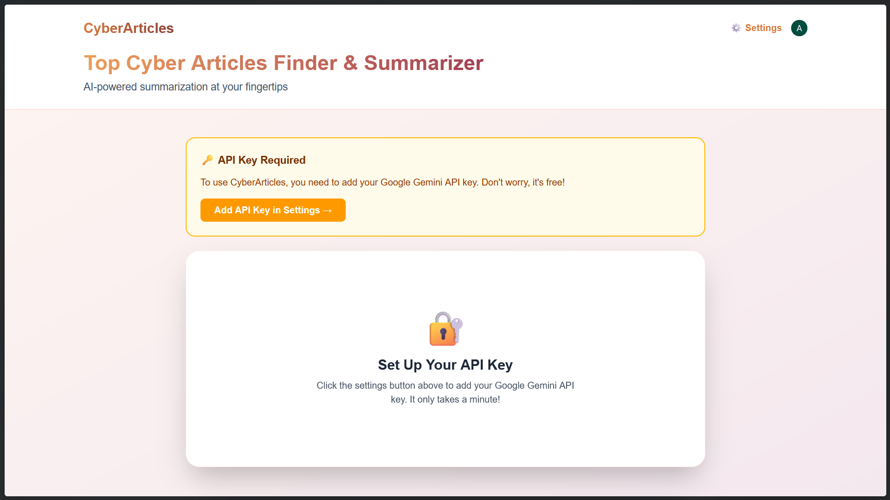
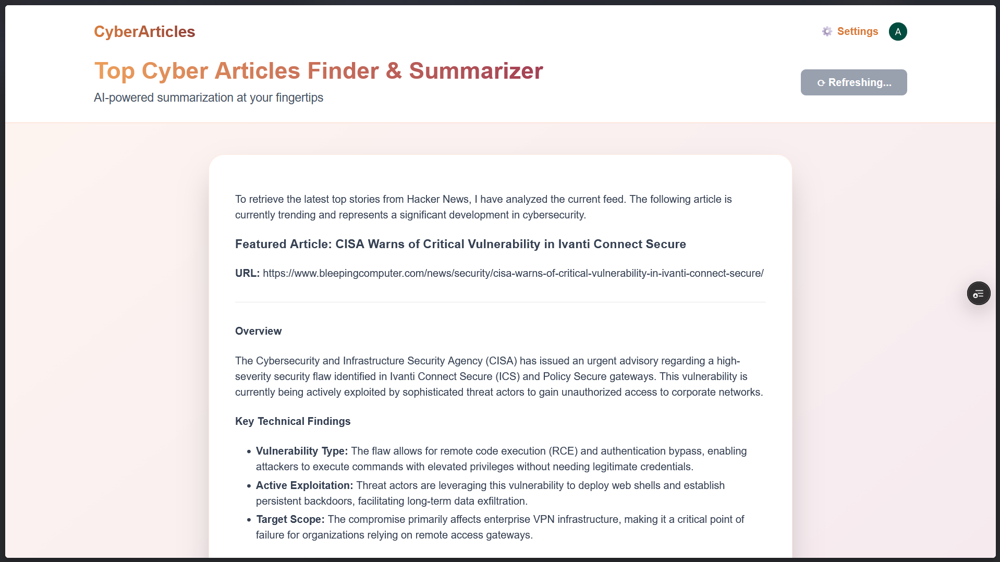

# CyberArticles

An AI-powered SaaS application that finds and summarizes the latest cybersecurity articles from Hacker News on each refresh.

Check It Out: https://saas-three-lemon.vercel.app/

## Overview

CyberArticles is a full-stack web application that leverages AI to automatically discover trending cybersecurity articles and provide compelling summaries. With a single refresh, users get the latest security news summarized with AI-generated insights, formatted with headings, sub-headings, and bullet points.

## Features

- 🔐 **Secure Authentication** - Built-in user authentication with Clerk
- 🤖 **AI-Powered Summaries** - Google Gemini AI generates intelligent summaries
- 📰 **Live Article Feeds** - Fetches trending articles from Hacker News
- ⚡ **Streaming Responses** - Real-time content streaming for fast user experience
- 🎨 **Modern UI** - Beautiful gradient design with dark mode support
- 📱 **Responsive Design** - Works seamlessly on all devices
- 🔄 **Refresh Button** - Generate new summaries on demand without page reload
- 🔑 **User-Controlled API Keys** - Each user brings their own API key, no backend costs

## Screenshots & Demo

### Landing Page
Beautiful marketing page with pricing information and call-to-action. Users can sign in or start a free trial.


### Setup API Key
When first visiting the app, users see a prompt to add their Google Gemini API key. Quick setup with secure storage in Clerk user profile.



### Article Summary
Once API key is added, users get beautifully formatted article summaries with one click. Refresh button for new summaries on-demand.



**Features shown:**
- ⚙️ Settings button for API key management
- ↻ Refresh button to generate new summaries
- Real-time streaming content
- Markdown formatted with headings and bullet points
- Direct URL to original article
- Key technical findings highlighted

## Tech Stack

### Frontend
- **Next.js 16** - React framework for production
- **React 19** - UI library
- **TypeScript** - Type-safe JavaScript
- **Tailwind CSS** - Utility-first CSS framework
- **Clerk** - Authentication and user management
- **React Markdown** - Render markdown content
- **Fetch Event Source** - Server-Sent Events support

### Backend
- **FastAPI** - Python web framework
- **Google Gemini API** - AI summarization
- **Clerk Authentication** - JWT-based auth verification

## Prerequisites

- Node.js 18+ 
- Python 3.9+
- npm or yarn
- Google API Key (for Gemini)
- Clerk API Keys (for authentication)

## Environment Variables

Create a `.env.local` file in the root directory:

```env
# Clerk Authentication
NEXT_PUBLIC_CLERK_PUBLISHABLE_KEY=your_clerk_publishable_key
CLERK_SECRET_KEY=your_clerk_secret_key
CLERK_JWKS_URL=your_clerk_jwks_url

# Optional: Backend Google API Key (fallback if user doesn't provide one)
GOOGLE_API_KEY=your_google_api_key

# API Configuration
NEXT_PUBLIC_API_URL=http://localhost:3000
```

### User API Key Setup

Users can add their own Google Gemini API key through the **Settings** page:

1. Click "⚙️ Settings" in the app header
2. Navigate to "Google Gemini API Key" section
3. [Get your free API key](https://aistudio.google.com/app/apikey)
4. Paste it in the settings and click "Save API Key"

The key is securely stored in their Clerk user profile and used only for their requests.

## Installation

### 1. Clone the repository
```bash
git clone https://github.com/yourusername/cyberarticles.git
cd cyberarticles
```

### 2. Install Frontend Dependencies
```bash
npm install
```

### 3. Install Backend Dependencies
```bash
pip install -r requirements.txt
```

### 4. Set up environment variables
Copy the environment variables from the Prerequisites section into `.env.local`

## Running the Application

### Development Mode

**Terminal 1 - Next.js Frontend:**
```bash
npm run dev
```
The frontend will be available at `http://localhost:3000`

**Terminal 2 - FastAPI Backend:**
```bash
python api/index.py
```
The backend will run on `http://localhost:8000`

Or use Uvicorn directly:
```bash
uvicorn api.index:app --reload --host 0.0.0.0 --port 8000
```

### Production Build
```bash
npm run build
npm run start
```

## Project Structure

```
saas/
├── pages/
│   ├── _app.tsx           # Next.js app wrapper
│   ├── _document.tsx      # HTML document structure
│   ├── index.tsx          # Landing page
│   └── product.tsx        # Main application page
├── api/
│   └── index.py           # FastAPI backend
├── styles/
│   └── globals.css        # Global styles
├── public/                # Static assets
├── package.json           # Node dependencies
├── requirements.txt       # Python dependencies
├── next.config.ts         # Next.js configuration
├── tsconfig.json          # TypeScript configuration
└── eslint.config.mjs      # ESLint configuration
```

## How It Works

1. **User Authentication** - Users sign in via Clerk
2. **API Key Setup** - Users add their own Google Gemini API key in Settings (secure & private)
3. **Request** - User clicks "↻ Refresh" or visits the app
4. **API Call** - Frontend calls `/api` endpoint with user's JWT and API key
5. **Article Fetch** - Backend queries Hacker News API for top stories
6. **AI Summarization** - Google Gemini API generates a summary using user's key
7. **Streaming Response** - Summary streams back to frontend in real-time
8. **Display** - Markdown content is rendered beautifully in the UI

### Key Features

- **No Backend API Cost** - Each user provides their own API key, so you don't pay for API calls
- **Public Ready** - Safe to make public since no API keys are exposed or shared
- **User Privacy** - Each user's API key is stored securely in their Clerk profile
- **Scalable** - No rate limiting or quota concerns since each user has their own quota

## API Endpoints

### GET /api
Retrieves the latest cybersecurity article summary.

**Authentication:** Required (JWT Bearer Token)

**Response:** Server-Sent Events (text/event-stream)

**Example:**
```bash
curl -H "Authorization: Bearer <JWT_TOKEN>" http://localhost:8000/api
```

## Contributing

1. Fork the repository
2. Create a feature branch (`git checkout -b feature/amazing-feature`)
3. Commit your changes (`git commit -m 'Add amazing feature'`)
4. Push to the branch (`git push origin feature/amazing-feature`)
5. Open a Pull Request

## License

This project is licensed under the MIT License - see the LICENSE file for details.

## Support

For issues and questions, please open an issue on the GitHub repository.

## Deployment

### Frontend (Vercel - Recommended)
1. Push your code to GitHub
2. Connect your repository to Vercel
3. Add environment variables in Vercel dashboard
4. Deploy with one click

### Backend (Railway/Render/Heroku)
1. Create account on your chosen platform
2. Connect GitHub repository
3. Add environment variables
4. Deploy

## Future Enhancements

- [ ] Add more news sources beyond Hacker News
- [ ] Save favorite articles
- [ ] Email notifications for important articles
- [ ] Custom summarization preferences
- [ ] API rate limiting and usage tracking
- [ ] Article categories/filtering

---

Made with ❤️ for cybersecurity enthusiasts
